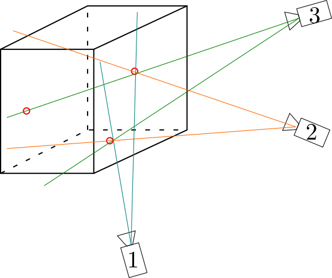

Center to rays
================

.. include:: isoamsr.txt

How to combine pictures to get particle positions in space?
    Let's consider only one particle. When the particle is seen by a camera, it is equivalent to draw a line in 3D space between the camera and the particle. The particle belongs to this line but we do not know the distance between it and the camera. 
    
    That is why, it is very important to look at the particle with several cameras. Indeed, doing that, we can draw in space as many lines as cameras. If we have *N* cameras and if the particle is seen by *n* |neq| *N* cameras, we will get *n* lines in space. Their intersection corresponds to the particle position.

    
    Scheme of center to rays process. Red circles show particles seen on the pictures. This step allows us to draw lines between cameras and observed particles on each frame.

|

We have seen that ``CenterFinding.m`` function provide 2D positions in pixel of each particle. ``Centers2Rays.m`` computes lines using the calibration data. So it takes all detected particle 2D positions and computes for each of these positions a line in 3D space. This function requires 4 arguments:

- **session**            : structure containing paths of MyPath folders,
- **ManipName**          : name of the experiment,
- **Calib**              : calib.mat file,
- **camID**              : list of camera numbers. ex: [1,2,3] if you have 3 cameras numbered 1,2,3 respectively,
- **Ttype** (optional)   : type of the transformation to use. 'T1' for linear transformation (defaut). 'T3' for cubic transformation. 

.. note::

    With testData, write in a MATLAB terminal:
    
    .. code-block:: matlab
        
        session.input_path = "My4DPTVInstallationPath/Documentation/TestData/";  % My4DPTVInstallationPath has to be adapted !!!
        session.output_path = "My4DPTVInstallationPath/Documentation/TestData/";
        [P, V] = Centers2Rays(session,"MyExperiment","My4DPTVInstallationPath/Documentation/TestData/DATA/MyCalibration/Pictures/calib.mat",[1,2,3])
        

Now we have a set of lines (called *rays*) in space so we can detect particle doing matching step. All rays are saved into an unique binary file *session.output_path/Processed_DATA/%ManipName/rays.dat*.			

.. warning:: 

    To use PSMN installations see :ref:`Centers2RaysPSMN`
