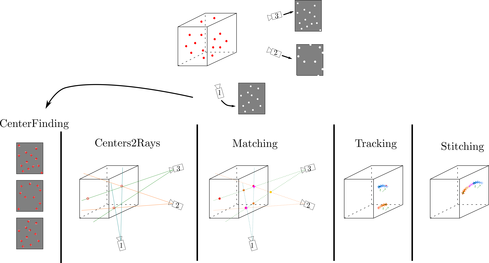

Data processing
****************

Now we asume that you did an experiment and that the calibration. So you have many pictures of your particles for each camera. The data has to be stored like this:

.. image:: Figures/FolderLagrangien.png
    :width: 300
    
    
We require one folder for each experiment with one subfolder per camera. Each subfolder contains the pictures from the camera with the convention: *MyExperiment_camN_B.extention* where N is the camera number, B the number of the picture and extension is the file extension.

There are 5 steps to get trajectories:

1. Center finding,
2. Centers to rays,
3. Matching,
4. Tracking,
5. Stitching.

Each of them are detailed hereafter. These 5 steps are schematized in the folowing figure.

    
    General scheme of all 4D-Particle Tracking Velocimetry processing.

.. Warning:: 

    The path to the root of the folder architecture is required as an input for almost every function. In this documentation, we will call this path **MyPath/**. As we will see in the following, this path is given to functions using **session.input_path** and **session.output_path** arguments. In a basic installation, both ot them are equal to **MyPath/** but it could be different if your *DATA/* and *Processed_DATA/* directories are not located in the same *MyPath/* folder.

