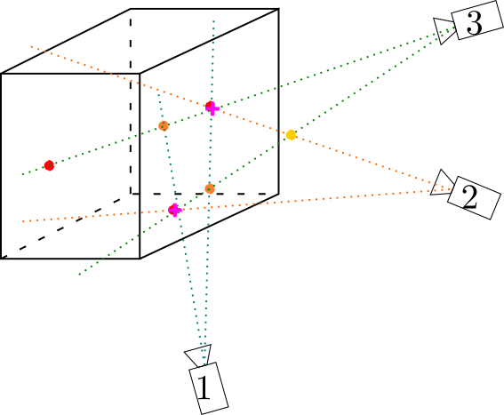
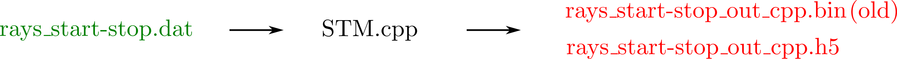

Matching
=========

How does it work?
    Let's consider again only one particle. If we have *N* cameras and if the particle is detected by *n* cameras, we have now :math:n lines in space. To determine the exact position of the particle, we have to find the closest point to these *n* lines simultaneously. The simpler method for that would be to take a line and to compute its distance to all other lines. Then taking the closest ones one gets particle position. However, this method would be very computing demanding.

    That's why we follow another method. As a picture is divided into pixels, we divide 3D space into small cubes called **voxel**. Then, all lines are drawn in this space. For each voxel, the distance between lines which crosses this voxel is computed. If the lines are close enough, a particle is created there. The space division into voxels decreases a lot computations because we only need to compute distance between lines crossing the voxel, which represents a very small number of computations comparing to compute the distance to all other lines.

    Besides, very powerful algorithm have been developped to drawn lines on pictures for television application. So the numerical cost to draw lines in a voxel space is very low.

    To get more information about matching step, see `Using ray-traversal for 3D particle matching in the context of particle tracking velocimetry <https://arxiv.org/abs/2003.12135>`_.

    General scheme of matching operation. Particles are localised at rays crossing points. Red particles are real particles, purple ones are *ghost particles* and yellow one is supressed as it is outside of the measurement volume. Purple crosses show detected particles.

|

This step has been written in ``Python`` and in ``C++``. The ``C++`` version is 5 times quicker but the ``Python`` one is simpler to use. We will describe both ot them in the following. **We strongly advice you to use ``C++`` version for which the support will be more efficient.**

Python way (Depreciated)
------------------------

The function which do the matching is ``STM.py``. It takes 11 arguments:

- **filename**                 : name of the file containing rays,
- **minframes**                : number of the first frame,
- **maxframes**                : number of the last frame,
- **cammatch**                 : minimum number of crossing rays to get a match,
- **maxdistance**              : max distance allowed for a match,
- **nx,ny,nz**                 : number of voxels in each direction,
- **maxmatchesperray**         : number of matches/ray,
- **boundingbox (optional)**   : corresponds to the volume visualized [[minX,maxX],[minY,maxY],[minZ,maxZ]],
- **neighbours (optional)**    : number of illuminated voxels: due to noise, when a ray crosses a voxel, it is possible that in reality, the ray crosses a close voxel. neighbours indicates how many neighbours we consider in reality when a ray crosses a voxel. =6 by defaut.

.. warning::
    Spatial unit:
        The distance unit is fixed during calibration step. Then all distances like maxdistance, boundingbox or particles positions are given in the same unit.

    Ghost particles:
        On the scheme, one can see orange particles. These particles does not correspond to real particles but they correspond to rays crossing points. These particles are called *ghost particles*. Setting the parameter *maxmatchesperray* to one can limit the number of these particles. However, if *maxmatchesperray* is equal to 1, then when two particles overlap, only one will be detected. That's why we prefere to set *maxmatchesperray* to 2. As ghost particles completely disapear between two successive frames, they will be suppressed by the tracking.

    Interest of boundingbox:
        On the scheme, there is two rays crosses outside of the measurement box (it is the yellow disk). As the boundingbox gives the space limits of measurement volume, this yellow particle is not consider as a match.

.. note::
    To run matching on test Data, in a terminal

    .. code-block:: bash

        python STM.py "../../Documentation/TestData/Processed_DATA/MyExperiment/Parallel/Matching/Rays/rays_1-10.dat" 1 10 2 0.2 400 400 250 2 ## To test !!! Check it !!!!

    To open the result file, use in a matlab terminal

    .. code-block:: matlab

        [matches,other,params] = readmatches("My4DPTVInstallationPath/Documentation/TestData/Processed_DATA/MyExperiment/matched_cam2_1-100.dat")

The function creates in the rays folder a file called *matched_cam{cammatch}_{minframe}-{maxframe}.dat* which contains all matched points. That kind of file can be openned with the function `readmatches.m` which provides 3 arrays:

- **matches** which is a nmatches x 5 matrix [FrameNumber, x, y, z, Error]
- **other** which is a nmatches x ? matrix [NumberofRaysUsedInMatch, cam0ID,ray0ID,cam1ID,rays1ID,...]
- **params** whose *params.nframes* gives number of frames and *params.nmatches* provides number of matches.

C++ way
--------

The ``C++`` script is al least 50 times faster than the ``Python`` one. This script should be use when you try to track more than 500-1000 particles because then the ``Python`` script is to long. If you track several thousands of particles, you should take a look at the PSMN part where we show how to parallelise computations.

.. warning:: Compilation of C++ code

    If you followed the installation process, you have already compiled the C++ code. If not, just do in a terminal

    .. code-block:: bash

        cd 4D-ptv/Matching/STMCpp/
        make

The ``C++`` function is ``STM`` and it takes 18 arguments:

- **inputfile** (*-i*): Input file,
- **output dir** (*-o*): Output directory,
- **frames** (*-f*): number of frames,
- **mincameras** (*-c*): minimum number of rays for a match,
- **maxdistance** (*-d*): maximum distance allowed for a match,
- **multiplematchesperraymindistance** (-s*): minimum allowed distance between matches found for the same ray,
- **maxmatchesperray** (*-m*): maximum matches per ray,
- **nx ny nz** (*-x -y -z*): number of voxels in each direction,
- **boudingbox** (*-b*): bouding box minX maxX minY maxY minZ maxZ.

By defaut, it saves results in a h5 file.

.. warning:: How to access to ``STM`` documentation?
    Do in a terminal

    .. code-block:: bash

        ./STM -h

    Input and output files of ``STM.cpp`` function.

with the same meaning than for Python way. The ``C++`` language requires to compile scripts before running them. That is done automatically during the library installation. The compiled version of ``STM.cpp`` is ``STM``.

How to compile ``STM.cpp`` file ?
    We did a ``makefile`` which simplifies everything for you. Before using the 4D-PTV toolbox for the first time, just do:

    .. code-block:: bash

        cd My4DPTVInstallationPath/4d-ptv/Matching/STMCpp/
        make

    That will compile all ``.cpp`` files you will need later.
    The command to compile a classic C++ code is:

    .. code-block:: bash

        g++ -std=c++11 -o STM.o STM.cpp

.. note::
    To run ``STM`` with test Data:

    .. code-block:: bash

        cd MyPath/4D-PTV/Matching/STMCpp/
        ./STM -i ../../Documentation/TestData/Processed_DATA/MyExperiment/Parallel/Matching/Rays/rays_1-10.dat -f 10 -c 2 -d 0.2 -m 2 -x 400 -y 400 -z 250 -b -140 140 -150 150 5 170

.. seealso::

    STM help:
        It is possible to show STM help doing:

        .. code-block:: bash

            ./STM -h

    Config file:
        The option ``--print-config`` of ``STM`` will create a config file containing all input parameters.

    How to install``g++``?
        It is installed by default on Linux. Otherwise:

        .. code-block:: bash

            sudo apt-get install -y build-essential
            sudo apt install gcc

.. warning::

    To use PSMN installations see :ref:`MatchingPSMN`
