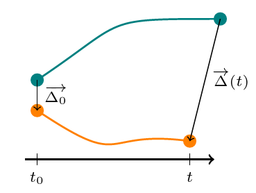

Post-Processing
===============

Once you get the track, we can use them to obtain physical results. 

Pair dispersion 
---------------

One interesting thing to study after doing 4d-PTV is relative pair dispersion. It's easy to do since we have the position of particles at any time. 
    
    

    
    
    
To compute pair dispersion, you will need three steps. 

First, you ned to compare the initial separation of all pairs of trajectory. To do this, use the function ``Dinitial.m``, which take three arguments
        
- **session**       : the path of your Processed_DATA directory. 
- **ManipName**     : the name of the experiment
- **size**          : the minimum length under which you will not consider a track. 
- **track**         : the structure that contains trajectories you need to compute the initial separation
        
This step will provide 3 files: ``Dinitial.mat`` which contains the initial separation between all tracks, ``S.mat`` and ``index.mat`` that contain positions in the S structure which interests us.
    
Then, you can use the function ``PariDisp.m`` which will compute the pair dispersion for a given inital separation. The arguments are:
        
- **session**       : the path of your Processed_DATA directory. 
- **ManipName**     : the name of the experiment
- **SeuilInit**     : the initial separation you want to compute
- **DeltaSeuil**    : the minimum size of the bin. This parameters can vary as function of the number of tracks you want for averagin convergence 
- **DeltaInc**      : the increment you want on the bin size if the initial one is too small to get convergence criteria (typically DeltaSeuil/2 is a good value).
- **Espilon**       : the rate of kinetic energy dissipation for your experiment 
- **Ech**           : the acquisition rate (in Hz)
- **MinConv**       : the minimum number of track pairs per bin. This will have an impact on the size of the bin, if you aksed for too much particles, your bin size could become too large
- **NbFrame**       : the value of the ``size`` argument you used in ``Dinitial.mat`` 
        
At the end of this step, you will obtain a structure containing the statistics of pair dispersion, the bin size, the time and the value of t* and the number of couple of tracks as a function of time. This last data is very important because the number of couple will decrease with time (because you will have less and less of long track) and this could strongly destroy the convergence of your curve. You will see it ploting the pair dispersion, at first it's very smooth curve but as you loose tracks at every time step, the curve will become noisy and small jumps will appear, even that after a certain time the data mean nothing. So pay attention to this when you interpret your curve.
You can also use a compiled version of the function using:
    
    .. code-block:: matlab 
    
        mcc -m submission_PairDisp.m    

Then, it possible to launch job at the PSMN, as for the previous step, by using ``submission_PairDisp.sh`` and complete the header of the function. 
    
Once you've done the previous processing steps, you can use the function ``PlotDispersion.m`` to plot the pair dispersion. It takes as arguments:
        
- **session**           : the path of your Processed_DATA directory. 
- **ManipName**         : the name of the experiment
- **Init**              : the first initial separation to plot
- **Last**              : the last initial separation to plot 
- **Pas**               : the step between 2 initial separation 
- **Norm** (optional)   : it's a boolean (``true`` of ``false``) to set to ``true`` (it's ``false`` if there is no indication) if you want to compensate the curbe by t^n
- **P**                 : use it if you set ``Norm`` to ``true``, P will be the exponent of t.
