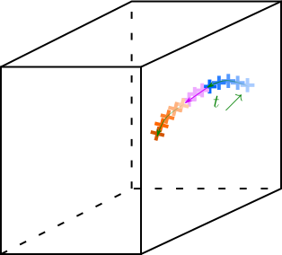

Stitching
==========

Why?
    Sometimes, a particle is not detected on several frame. So tracking code will find several trajectories which correspond in fact to only one trajectory. The stitching step will reconnect these splited trajectories. 
    
How does it work?
    Let's consider a trajectory **A** which ends at the frame :math:`ff`. We look for all trajectories **B** which starts between frame :math:`ff` and :math:`ff+dfmax`. The particle velocity at the end of the trajectory A noted :math:`v_A` is computed using the last :math:`lmin/2` points. We will note **df** the number of lost frames between trajectories A and B. Please note that :math:`df<=dfmax`. Knowing the velocity at the end of trajectory A, it becomes possible to estimate where the particle should be :math:`df` frames later considering the particle went straight:
    :math:`x_{estimated}=x_{ff}+df\\times v_A`. 
    So the estimated position is compared to initial position of trajectory :math:`B`.  Only those which are closer in norm than :math:`dxmax`. The exact criterion is given below:
    :math:`||x_B-x_{estimated}||<dxmax`.
    This criterion is not sufficient especially when many particles are tracked simultaneously. Indeed, a criterion on the velocity has to be added. The velocity at the begining of trajectory :math:`B` noted :math:`v_B`, is also calculated from :math:`lmin/2` first points of trajectory :math:`B`. We use a criterion on the relative velocity components between \v_A\;\ and \v_B\;\ as described below:
    $$\\frac{v^i_B-v^i_A}{v^i_A}<dvmax \\quad \\text{with } i=x,y,z.$$
    If several trajectories :math:`B` respect all of these criteria, we keep the one such as :
    
        

    
    Scheme of stitching processing. Two trajectories are represented in red and blue, and the color shows time evolution. Particle was lost for several frames (in violet) and this step reconnect the two trajectories.
    
The function ``Stitching.m`` is useful for that and takes 7 arguments:

- **session**     : Path to the architecture root
- **ManipName**   : Name of the experiment
- **FileName**    : Name of the tracks file
- **dfmax**       : maximum number of tolerated missing frames to reconnect to trajectories,
- **dxmax**       : maximum tolerated distance (in norm) between projected point after the first trajectory and the real beginning position of the stitched one,
- **dvmax**       : maximum tolerated relative velocity difference (component by component) between the end of the first trajectory and the beginning of the stitched one,
- **lmin**        : minimum length for a trajectory to be stitched.

The function ``Stitching.m`` will create a file **stitched_FileName_dfmax.h5** in the folder **ManipName**. Be careful, the code returns an error if it rewrites an existing file.

.. warning:: 

    To use PSMN installations see :ref:`StitchingPSMN`
