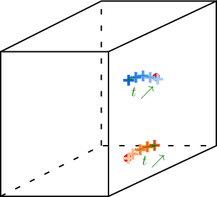

Tracking
==========

How does it work?
    The matching step provides particle positions in 3D space for each frame. Then how to find particles trajectory? The simplest method is the *closest neighbour method* and is schematized in the figure below. Let's take a particule :math:`P` at time :math:`t` (in black on the scheme). At time :math:`t+dt` (red particles), we will look for the closest particle to :math:`P` and will consider that it is the same particle (strond red particle). Doing that successively for all frames we will get the trajectory of particle :math:`P`. 
    
    .. figure:: Figures/ClosestNeighbour.jpg
        :width: 40%
        
        On the left, good tracking. On the right, typical tracking mistake.
        
|
        
    However, when there are many particles in the flow, it is higly probable to do errors when other particles goes behing particle :math:`P`. This typical situation is represented on the right in the figure: particles two particles are tracked but when they become close this tracking method makes a mistake. The yellow particle is closer to the blue one so is attributed to the blue trajectory although it belongs to the black trajectory.
    To avoid that kind of mistakes, we do *predictive tracking*. For each time :math:`t`, we estimate the expected particle position thanks to previous particle position and then we look for the closest particle to the expected position.
    

    
    General sketch of tracking. Two trajectories are shown here. Particles position for 5 successive frames are represented by crosses and their colour determines the time evolution.
    

The function ``track3d.m`` was made for that and requires 10 arguments:

- **session**   : Paths to the architecture root
- **ManipName** : Name of the experiment
- **FileName**  : Name of the matched file without its extension (without .dat)
- **NbFrame**   : Number of frame in the file
- **maxdist**   : Maximum travelled distance between two successive frames
- **lmin**      : Minimum length of a trajectory (number of frames)
- **flag_pred** : 1 for predictive tracking, 0 otherwise
- **npriormax** : Maximum number of prior frames used for predictive tracking
- **flag_conf** : 1 for conflict solving, 0 otherwise
- **minFrame**  : (optional) number of the first frame. Default = 1.


    
    Input and output files of ``track3d.m`` function.

This function creates folders and calls ``track3d_manualfit.m`` function which estimates the next particle positions doing a *manual fit* instead of using ``polyfit`` function which is 30 times longer. The expected particle position is estimated using the last *npriormax* points. It creates a MATLAB structure and saves it as a file *session.output_path/Processed_DATA/ManipName/tracks_%FileName.h5*. This .h5 file can be openned with the function ``h52tracks.m``` function which creates a MATLAB structure from the .h5 file. For each trajectory indexed by *kt*, the structure called here *traj* has the fields:

- traj(kt).ntraj  : trajectory index,
- traj(kt).L      : trajectory length,
- traj(kt).frames : trajectory frames,
- traj(kt).x      : x-position,
- traj(kt).y      : y-position,
- traj(kt).z      : z-position,
- traj(kt).nmatch : element indices in tracks.

.. warning::
    It is also possible to do predictive tracking only when there are some conflict using ``track3d_polyfit.m`` function. For that, see the last lines of ``track3d.m`` function. ``track3d_polyfit.m`` function do closest neighbour tracking generally and predictive tracking only when two particles could belong to the same trajectory. In that case, called *conflict situation*, it uses ``polyfit`` function to estimate particle position. ``track3d_polyfit.m`` function provides very similar trajectories than ``track3d_manualfit.m`` with a difference of 0.1% in terms of number of trajectories. This difference reveals that less particules are lost with ``track3d_polyfit.m``.

.. note::
    To run tracking for test data:
    
    .. code-block:: matlab
        
        session.input_path = "My4DPTVInstallationPath/Documentation/TestData/";  % My4DPTVInstallationPath has to be adapted !!!
        session.output_path = "My4DPTVInstallationPath/Documentation/TestData/";
        [tracks,traj]=track3d(session, "MyExperiment", "cam2_1-100",0.2,5,1,5,1);
    
    To read output file:
    
    .. code-block:: matlab
        
        traj = h52tracks("My4DPTVInstallationPath/Documentation/TestData/MyExperiment/tracks_matched_cam2_1-100");

.. warning:: 
    How to run a compiled version of the ``track_3d.m``?

    It is possible to compile ``CenterFinding2D.m`` function to run it outside a MATLAB instance directly in a terminal. This can be useful to run it on cluster, for instance at the PSMN. The function to use for that is ``Arg_CenterFinding2D_PSMN.m``. 

    How to do?
        1. Complete the header of the script ``Arg_CenterFinding2D_PSMN.m`` to fill all required argument for ``CenterFinding2D.m``. This script defines all arguments and calls ``CenterFinding2D.m`` function.

        2. Compile the script ``Arg_CenterFinding2D_PSMN.m`` doing in a matlab terminal:

            .. code-block:: matlab
                
                mcc -m Arg_CenterFinding2D_PSMN.m
                
            An executable file ``Arg_CenterFinding2D_PSMN`` will appear in the same folder.

        3. To run it in your machine:

            .. code-block:: bash

                ./Arg_CenterFinding2D_PSMN
                
            To run it on the PSMN, you have to set the environment with the script ``run_Arg_CenterFindingD_PSMN.sh``. Write in a terminal:
            
            .. code-block:: bash
                
                sh run_Arg_CenterFindingD_PSMN.sh $MCRROOT    


.. warning:: 

    To use PSMN installations see :ref:`TrackingPSMN`
